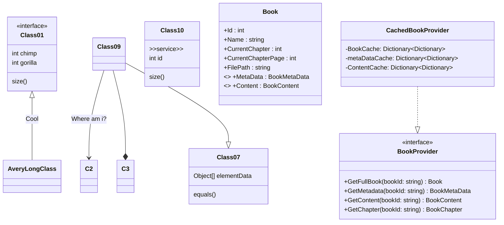

# ReadOtter: A personalized epub file reading software

```mermaid
classDiagram
Class01 <|-- AveryLongClass : Cool
<<interface>> Class01
Class09 --> C2 : Where am i?
Class09 --* C3
Class09 --|> Class07
Class07 : equals()
Class07 : Object[] elementData
Class01 : size()
Class01 : int chimp
Class01 : int gorilla
class Class10 {
  >>service>>
  int id
  size()
}
class Book{
    +Id : int
    +Name : string
    +CurrentChapter : int
    +CurrentChapterPage : int
    +FilePath : string
    <<NotMapped>> +MetaData : BookMetaData
    <<NotMapped>> +Content : BookContent
}

class BookProvider {
  <<interface>>
  +GetFullBook(bookId: string) Book
  +GetMetadata(bookId: string) BookMetaData
  +GetContent(bookId: string) BookContent
  +GetChapter(bookId: string) BookChapter
}

class CachedBookProvider {
    -BookCache: Dictionary&lt;Dictionary<int, Book>&gt;
    -metaDataCache: Dictionary&lt;Dictionary<int, BookMetaData>&gt;
    -ContentCache: Dictionary&lt;Dictionary<int, BookContent>&gt;
 }

CachedBookProvider ..|> BookProvider
```
