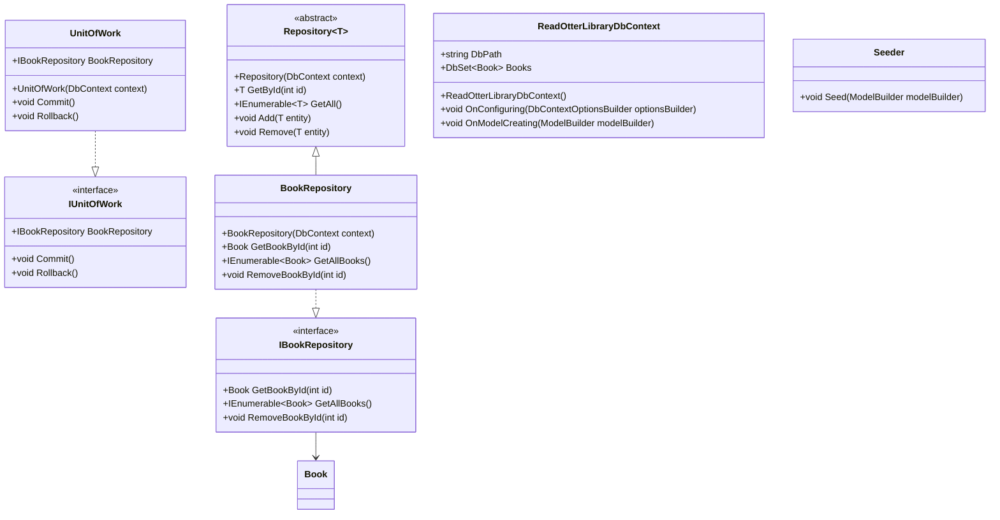

# ReadOtter: A personalized epub file reading software

## Backend Architecture

## Services

```mermaid
classDiagram
class Book {
    <<model>>
    +Id : int
    +Name : string
    +CurrentChapter : int
    +CurrentChapterPage : int
    +FilePath : string
    ~NotMapped~ +MetaData : BookMetaData
    ~NotMapped~ +Content : BookContent
}

class BookMetaData {
    +Creators : IEnumerable~string~
    +Publishers : IEnumerable~string~
}

class BookContent {
    +Chapters : IEnumerable~ContentChapter~
}

class ContentChapter {
    +Title : string
    +Content : string
}

class BookProvider {
    <<interface>>
    +GetFullBook(bookId: string) : Book
    +GetMetadata(bookId: string) : BookMetaData
    +GetContent(bookId: string) : BookContent
    +GetChapter(bookId: string) : BookChapter
}

class CachedBookProvider {
    -BookCache : Dictionary~int, Book~
    -MetaDataCache : Dictionary~int, BookMetaData~
    -ContentCache : Dictionary~int, BookContent~
    -ChapterCache : Dictionary~int, List~BookChapter~
}

class BookCommonService {
    +BookCommonService(unitOfWork: IUnitOfWork) : BookCommonService
    +GetAllBooks() : IEnumerable~Book~
    +GetAllBookIds() : IEnumerable~int~
}

class EpubContentService {
    +EpubContentService(unitOfWork: IUnitOfWork, versOneWrapperService: IVersOneAdaptorService) : EpubContentService
    +OffsetBookCurrentChapter(id: int, offset: int) : void
    +OffsetBookCurrentChapter(book: Book, offset: int) : void
    +GetCurrentChapterTextContent(id: int) : string
    +GetCurrentChapterTextContent(book: Book) : string
}

class EpubMetadataService {
    +EpubMetadataService(unitOfWork: IUnitOfWork, versOneWrapperService: IVersOneAdaptorService) : EpubMetadataService
    +GetBookMetaData(id: int) : BookMetaData
    +GetBookMetaData(book: Book) : BookMetaData
}

class InputService {
    +InputService() : InputService
    +HandleInput(input: string) : void
}

class IVersOneAdaptorService {
    <<interface>>
    +EpubBookRef GetEpubBookRef(Book book, EpubReaderOptions? readerOptions = null)
    +EpubBook GetEpubBook(Book book, EpubReaderOptions? readerOptions = null)
    +BookMetaData GetMetaData(Book book)
    +string GetContentForChapter(Book book, int chapterIndex)
    +int GetTotalChapterCount(Book book)
}

class VersOneAdaptorService {
    +GetEpubBookRef(book: Book, readerOptions: EpubReaderOptions ) : EpubBookRef
    +GetEpubBook(book: Book, readerOptions: EpubReaderOptions ) : EpubBook
    +GetMetaData(book: Book) : BookMetaData
    +GetContentForChapter(book: Book, chapterIndex: int) : string
    +GetTotalChapterCount(book: Book) : int
}

class ServiceBase {
    <<abstract>>
    #_unitOfWork : IUnitOfWork
    +ServiceBase(unitOfWork: IUnitOfWork) : ServiceBase
}

class IUnitOfWork {
    <<interface>>
    +void Commit()
    +void Rollback()
    +IBookRepository BookRepository
}

class UnitOfWork {
    +UnitOfWork(DbContext context)
    +void Commit()
    +void Rollback()
    +IBookRepository BookRepository
}

class IBookRepository {
    <<interface>>
    +Book GetBookById(int id)
    +IEnumerable~Book~ GetAllBooks()
    +void RemoveBookById(int id)
}

class BookRepository {
    +BookRepository(DbContext context)
    +Book GetBookById(int id)
    +IEnumerable~Book~ GetAllBooks()
    +void RemoveBookById(int id)
}

class Repository~T~ {
    <<abstract>>
    +Repository(DbContext context)
    +T GetById(int id)
    +IEnumerable~T~ GetAll()
    +void Add(T entity)
    +void Remove(T entity)
}

class ReadOtterLibraryDbContext {
    +string DbPath
    +DbSet~Book~ Books
    +ReadOtterLibraryDbContext()
    +void OnConfiguring(DbContextOptionsBuilder optionsBuilder)
    +void OnModelCreating(ModelBuilder modelBuilder)
}

class Seeder {
    +void Seed(ModelBuilder modelBuilder)
}

CachedBookProvider ..|> BookProvider
BookCommonService --> ServiceBase
EpubContentService --> ServiceBase
EpubMetadataService --> ServiceBase
InputService --> ServiceBase
VersOneAdaptorService ..|> IVersOneAdaptorService
UnitOfWork ..|> IUnitOfWork
BookRepository ..|> IBookRepository
Repository~T~ <|-- BookRepository
IBookRepository --> Book
Book --> BookMetaData
Book --> BookContent

```

## Database Access

```mermaid
classDiagram

class IUnitOfWork {
    <<interface>>
    +void Commit()
    +void Rollback()
    +IBookRepository BookRepository
}

class UnitOfWork {
    +UnitOfWork(DbContext context)
    +void Commit()
    +void Rollback()
    +IBookRepository BookRepository
}

class IBookRepository {
    <<interface>>
    +Book GetBookById(int id)
    +IEnumerable~Book~ GetAllBooks()
    +void RemoveBookById(int id)
}

class BookRepository {
    +BookRepository(DbContext context)
    +Book GetBookById(int id)
    +IEnumerable~Book~ GetAllBooks()
    +void RemoveBookById(int id)
}

class Repository~T~ {
    <<abstract>>
    +Repository(DbContext context)
    +T GetById(int id)
    +IEnumerable~T~ GetAll()
    +void Add(T entity)
    +void Remove(T entity)
}

class ReadOtterLibraryDbContext {
    +string DbPath
    +DbSet~Book~ Books
    +ReadOtterLibraryDbContext()
    +void OnConfiguring(DbContextOptionsBuilder optionsBuilder)
    +void OnModelCreating(ModelBuilder modelBuilder)
}

class Seeder {
    +void Seed(ModelBuilder modelBuilder)
}

UnitOfWork ..|> IUnitOfWork
BookRepository ..|> IBookRepository
Repository~T~ <|-- BookRepository
IBookRepository --> Book
```
